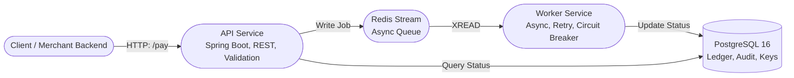

# OpenPay UPI Gateway

**OpenPay UPI Gateway**
*Enterprise-Grade Modular UPI Payment Processor — Java 21, Spring Boot 3.x, PostgreSQL 16, Redis Streams, and Audit-First Design*

---

## Table of Contents

1. [Overview](#overview)
2. [Solution Architecture](#solution-architecture)
3. [Core Modules](#core-modules)
4. [Domain Model](#domain-model)
5. [API Surface](#api-surface)
6. [Reliability & Idempotency](#reliability--idempotency)
7. [Development & Deployment](#development--deployment)
8. [Production Practices](#production-practices)
9. [Testing & Audit](#testing--audit)
10. [Contributing](#contributing)
11. [Maintainer & License](#maintainer--license)

---

## Overview

OpenPay is a **modular, auditable, and production-ready UPI payment gateway**.
It is built for extensibility, observability, and compliance, suitable for regulated, high-availability environments.

**Design Goals:**

* **Isolation:** Each core concern (API, Worker, Shared Libraries, DB) is a self-contained module.
* **Auditability:** Every transactional action is tracked; all public APIs and entities are JavaDoc’d.
* **Idempotency:** Distributed-safe, duplicate-proof, and multi-service resilient.

---

## Solution Architecture



**Key Patterns:**

* **CQRS Light:** Writes are async (queued), reads are direct (status query).
* **Decoupled Async:** All payments are processed via stream; API is never blocking on DB.
* **Clear API/Worker split:** Enables scaling, operational isolation, and future microservice separation.

---

## Core Modules

| Module           | Artifact                          | Responsibility                                        |
| ---------------- | --------------------------------- | ----------------------------------------------------- |
| `api-service`    | REST API, Idempotency, Validation | Receives payment requests, validates, queues to Redis |
| `worker-service` | Redis Consumer, Processor         | Consumes jobs, processes UPI flow, updates DB         |
| `shared-libs`    | DTOs, Exceptions, Validation      | Shared types, exception classes, annotations          |
| `database`       | Flyway Migrations, Schema         | Versioned SQL, audit & ledger tables                  |

---

## Domain Model

**Primary Entities:**

* **Transaction**: UPI payment (sender, receiver, amount, status, timestamps)
* **TransactionHistory**: Immutable audit trail for status changes, failures, retries
* **IdempotencyKey**: Ensures once-only semantics for payment initiation

---

## API Surface

### Core Endpoints

| Method | Path                       | Description          | Idempotency | Status Codes  |
| ------ | -------------------------- | -------------------- | ----------- | ------------- |
| POST   | `/pay`                     | Initiate new payment | Yes         | 201, 400, 409 |
| GET    | `/transaction/{id}/status` | Poll transaction     | N/A         | 200, 404      |

* **API returns**: Transaction ID, status, message
* **Errors**: Detailed, structured error payloads, mapped via global handler

---

## Reliability & Idempotency

* **All writes use idempotency keys** (header: `Idempotency-Key`).
* **Duplicate suppression** at both API and worker level.
* **Transaction status** is immutable post-completion/failure.
* **Retries/Failures**: Handled via stream requeue/DLQ (future work branch).

---

## Development & Deployment

### Prerequisites

* Java 21+
* Maven 3.9+
* PostgreSQL 16
* Redis 6+ (Memurai or native)

### Local Setup

1. **Provision Database**

   ```sql
   CREATE DATABASE openpay_db;
   CREATE USER openpay_user WITH ENCRYPTED PASSWORD 'openpay_pass';
   GRANT ALL PRIVILEGES ON DATABASE openpay_db TO openpay_user;
   ```

2. **Apply Migrations**

   ```sh
   mvn -pl api-service flyway:migrate
   ```

3. **Start Services**

   ```sh
   cd api-service && mvn spring-boot:run
   # (In a new terminal)
   cd ../worker-service && mvn spring-boot:run
   ```

4. **Test (Manual Example)**

   ```sh
   curl -X POST http://localhost:8080/pay \
     -H "Content-Type: application/json" \
     -H "Idempotency-Key: demo-123" \
     -d '{"senderUpi":"alice@upi","receiverUpi":"bob@upi","amount":100.25}'
   ```

---

## Production Practices

* **Schema migrations**: Managed and versioned with Flyway; never edit existing scripts after apply.
* **Secrets/config**: All passwords/secrets in environment vars or `.env` (never committed).
* **Logging**: SLF4J structured logging, audit tags, MDC-ready for correlation IDs.
* **Observability**: Health endpoint, error traces, all critical paths logged.

---

## Testing & Audit

* **Build**: `mvn clean install` (all modules)
* **E2E**: Manual E2E validated (API → Redis → Worker → DB)
* **Code Quality**: All core classes JavaDoc’d, checkstyle/PMD ready
* **Review**: PR merges require a single commit, descriptive message, and doc update

---

## Contributing

* **Branch** from `main`
* **Feature naming**: `feature/<description>`
* **Commits**: Use multi-line, audit-style messages
* **Tests**: Manual and/or unit where appropriate; run all tests before PR
* **Pull Request**: Describe what, why, and impact; attach evidence (logs/screenshots) if possible

---

## Maintainer & License

* **Maintainer**: David Grace
  [gracemann365 on GitHub](https://github.com/gracemann365)
* **License**: MIT

---

**For onboarding, integration queries, or security audits, open an issue or contact the maintainer.**

---

