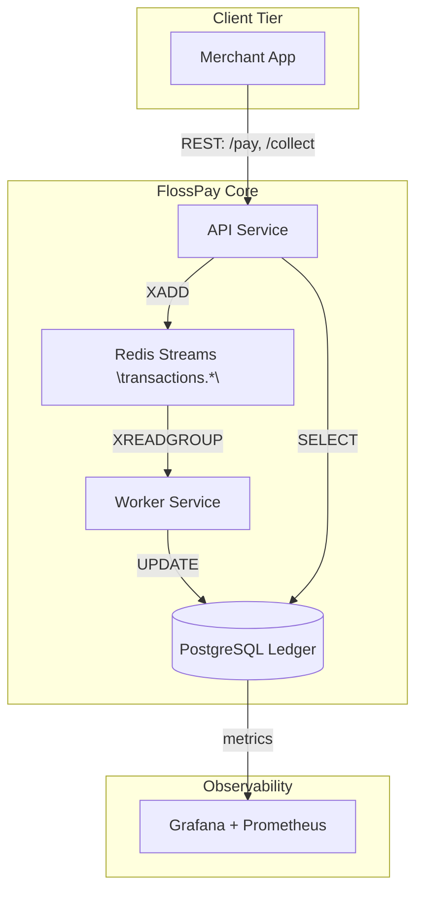

```text

                 /$$$$$$$$/$$                              /$$$$$$$
                | $$_____/ $$                             | $$__  $$
                | $$     | $$  /$$$$$$   /$$$$$$$ /$$$$$$$| $$  \ $$/$$$$$$  /$$   /$$
                | $$$$$  | $$ /$$__  $$ /$$_____//$$_____/| $$$$$$$/____  $$| $$  | $$
                | $$__/  | $$| $$  \ $$|  $$$$$$|  $$$$$$ | $$____/ /$$$$$$$| $$  | $$
                | $$     | $$| $$  | $$ \____  $$\____  $$| $$     /$$__  $$| $$  | $$
                | $$     | $$|  $$$$$$/ /$$$$$$$//$$$$$$$/| $$    |  $$$$$$$|  $$$$$$$
                |__/     |__/ \______/ |_______/|_______/ |__/     \_______/ \____  $$
                                                                             /$$  | $$
                                                                            |  $$$$$$/
                                                                             \______/
```

---

**FlossPay** is a **Kernel-inspired**, **enterprise-grade** Free/Libre Open-Source payments aggregator.
Modeled after **Linux’s** rigorous governance (meritocratic maintainership, strict code review, transparent changelogs) and **Oracle Financials** audit-first architecture (immutable ledgers, compliance-ready schemas), **FlossPay** delivers bank-grade reliability to indie merchants, MSMEs, and developers.
With a community-driven ethos, FlossPay removes barriers and empowers small businesses with open, transparent infrastructure.

> **Current Rail Availability**: _v0.2-alpha offers a hardened **UPI rail**, fully tested and validated; downstream rails (cards, wallets, net-banking) are tracked via stable branches and will not affect core stability._

---

## Vision & Mission

### Vision

Empowers indie merchants, MSMEs, and developers with Payment infrastructure which is **Open**, **Transparent**, and **Accessable**.

### Mission

Deliver an **Auditable**, **Modular**, **Self-hostable** payments platform that delivers Bank-Grade **Reliabilitys** while remaining **FLOSS**.

---

# ⚠️ **Legal Notice**

> **This software is provided “AS IS” and “AS AVAILABLE” — with _NO WARRANTY_ of any kind.**
>
> By accessing, using, modifying, or distributing this project, you AGREE that:
>
> - The authors and contributors are **NOT liable** for any damages, legal issues, or regulatory actions (direct or indirect) arising from any use of this software.
> - This project is for **educational and template purposes** ONLY.  
>   **Any commercial, financial, or production use is 100% at your own risk.**
> - If you use this software in any operational, production, or commercial context, you are **solely responsible** for all legal, regulatory, and compliance obligations—US, EU, and international.
> - See [LICENSE](LICENSE) for full terms.
>
> **If you do NOT agree to these terms, do NOT use or access this codebase.**

---


## Table of Contents

1. [Vision & Mission](#vision--mission)
2. [Solution Architecture](#solution-architecture)
3. [Project Structure](#project-structure)
4. [Domain Model](#domain-model)
5. [API Reference](#api-reference)
6. [Roadmap](#roadmap)
7. [Idempotency & Reliability](#idempotency--reliability)
8. [Getting Started](#getting-started)
9. [Production Readiness](#production-readiness)
10. [Testing & Auditing](#testing--benchmarking)
11. [Contributing](#contributing)
12. [Community & Support](#community--support)
13. [License & Maintainers](#license--maintainers)

---

## Solution Architecture

<details>
<summary>View Architecture Diagram</summary>



</details>

**Key Principles**

- **Modularity**: Clear service contracts for scalability.
- **Async Resilience**: Failure-isolated pipelines via Redis Streams.
- **Auditability**: Immutable ledger with SHA-256 checksums.

---

## Project Structure

| Module           | Responsibility                                         | Key Technologies                    |
| ---------------- | ------------------------------------------------------ | ----------------------------------- |
| `api-service`    | Public REST API, OpenAPI spec, validation, idempotency | Spring Boot 3.x, Java 21            |
| `worker-service` | Async processing, retries, DLQ, webhook emit           | Java 21, Spring Boot, Redis Streams |
| `shared-libs`    | DTOs, validation, exception hierarchy                  | Java Module System                  |
| `docs`           | UML diagrams, ADRs, system design, benchmarks          | Asciidoc, PlantUML                  |
| `ops`            | Docker, Helm, Terraform, GitHub Actions                | DevOps Stack                        |

---

## Domain Model

| Entity                  | Purpose                     | Core Fields                                         |
| ----------------------- | --------------------------- | --------------------------------------------------- |
| `Transaction`           | Generic payment intent      | id · amount · currency · method · status            |
| `TransactionHistory`    | Lifecycle state changes     | txn_id · status_from · status_to · timestamp        |
| `PaymentMethod`         | Supported rails enum        | UPI · CARD · WALLET · NETBANKING                    |
| `CardTransaction`       | Card-specific data          | pan_token · expiry · scheme                         |
| `WalletTransaction`     | Wallet-specific data        | wallet_id · provider                                |
| `IdempotencyKey`        | Guarantees at-most-once     | key · owner · expiry                                |
| `WebhookEvent`          | Outbound notifications      | id · type · payload · retries                       |
| `WebhookCallback`       | Tracks delivery & retries   | callback_id · txn_id · url · status · attempts      |
| `ServiceCircuitBreaker` | Monitors 3rd-party services | service_name · state · failure_count · last_failure |
| `ClientRateLimit`       | API quota state             | client_id · tokens · last_refill                    |


---

## API Reference

> **Scope:**
> This release exposes only foundational payment and health endpoints. All other interfaces are under active RFC and subject to review.

### **Base Path:** `/api/v1`

---

| Method | Endpoint                   | Description                         | Idempotent | AuthN / AuthZ                            | Response Codes                            |
| ------ | -------------------------- | ----------------------------------- | ---------- | ---------------------------------------- | ----------------------------------------- |
| POST   | `/pay`                     | Initiate a UPI push payment         | Yes        | HMAC-SHA256, required<br>`X-HMAC` header | 200 OK<br>400 Bad Request<br>409 Conflict |
| POST   | `/collect`                 | Initiate a UPI pull/collect request | Yes        | HMAC-SHA256, required<br>`X-HMAC` header | 202 Accepted<br>400 Bad Request           |
| GET    | `/transaction/{id}/status` | Retrieve transaction status by ID   | No         | HMAC-SHA256, required<br>`X-HMAC` header | 200 OK<br>404 Not Found                   |
| GET    | `/health`                  | Liveness check (simple ping)        | N/A        | No Auth (public)                         | 200 OK                                    |
| GET    | `/health/ready`            | Readiness check (system ready)      | N/A        | No Auth (public)                         | 200 OK<br>503 Service Unavailable         |

---

### **Authentication**

* **All payment endpoints** require HMAC-SHA256-based authentication.

  * Client must sign the canonical request and set:
    `X-HMAC: <Base64 signature>`
  * **Idempotency** enforced via `Idempotency-Key` header (required, unique per request).

### **Content Negotiation**

* **Content-Type:**

  * All requests and responses: `application/json`
* **Versioning:**

  * All endpoints are namespaced under `/api/v1` (future-proofing).

### **Health Endpoints**

* `/health`

  * Stateless liveness probe; always returns `"liveness Check : Im Alive"` on 200 OK.
* `/health/ready`

  * Readiness probe; returns `"READY"` on 200 OK (future: returns 503 if dependencies unavailable).

### **Standardization & Compliance**

* All endpoints and headers are documented in the [OpenAPI 3.1](./docs/openapi.yaml) specification.
* API is designed for extension with additional rails (card, wallet, net-banking) via pluggable modules.
* **Security-first:** All authentication and error flows are explicitly logged and traceable (PCI-DSS/SOC2-ready).

---

### Example: `/pay` Request

```bash
curl -X POST http://localhost:8080/api/v1/pay \
  -H "Content-Type: application/json" \
  -H "Idempotency-Key: unique-key-280" \
  -H "X-HMAC: <your-signature-here>" \
  -d '{"senderUpi": "flossalice@upi", "receiverUpi": "flossbob@upi", "amount": 28.00}'
```

*Swagger/OpenAPI UI is available at [`/swagger-ui.html`](http://localhost:8080/swagger-ui.html) for live contract validation.*

---

**Principles:**

* **Transparency**: All behaviors, errors, and flows are deterministic and documented.
* **Interoperability**: Headers, request/response codes, and conventions follow industry standards for maximum compatibility.
* **Auditability**: All actions are logged with immutable trails; full replay possible.
* **Extensibility**: New rails and endpoints must conform to the base spec and pass regression coverage before merge.

---

If you want even **stricter, more formal RFC-style markdown**, let me know and I can increase the level further!

## Roadmap

| Phase / Branch                   | Core Deliverables                                   | Why it Matters                |
| -------------------------------- | --------------------------------------------------- | ----------------------------- |
| `feature/advanced-tx-feat`       | Retry · DLQ · Audit trail · Webhooks · Rate-limiter | Enterprise reliability        |
| `test/suite-performance_metrics` | Load/soak · Chaos suite                             | BigTech QA standards          |
| `ship/e2e-documentation`         | UML diagrams · ADRs · Benchmarks                    | Interview-grade documentation |
| `ship/ossify`                    | Issue templates · Badges · Code of Conduct          | Community engagement          |
| **Post-MVP (coming soon)**       |                                                     |                               |
| `feature/devops`                 | CI/CD hardening · Docker/Compose                    | Prod zero-touch deployments   |
| `feature/iac-k8-aws-deployment`  | Terraform & Helm charts for AWS/EKS                 | Cloud-native credibility      |
| `feature/sre-monitoring`         | SLOs · Alerting · Runbooks · Chaos                  | SRE discipline                |

---

## Idempotency & Reliability

_Powered by enterprise-grade security and compliance to match Oracle-level standards._

## FlossPay: Security, Reliability & Compliance Matrix

> All features below are engineered for **compliance-by-default**, auditability, and absolute determinism. Controls are **FLOSS-auditable**; no “checkbox” security or black-box behaviors.

| **Control Area**            | **Mechanism & Enforcement**                                                                                                                                                                                                                                                   | **Standard / Reference**                                                                                             | **Status**                  |
| --------------------------- | ----------------------------------------------------------------------------------------------------------------------------------------------------------------------------------------------------------------------------------------------------------------------------- | -------------------------------------------------------------------------------------------------------------------- | --------------------------- |
| **Idempotency**             | `Idempotency-Key: <uuid4>` required per operation. UUIDv4 (cryptographically random), validated per [RFC 4122](https://datatracker.ietf.org/doc/html/rfc4122). Replay resistance enforced via HMAC ([RFC 2104](https://datatracker.ietf.org/doc/html/rfc2104)), TTL-governed. | [RFC 4122](https://datatracker.ietf.org/doc/html/rfc4122), [RFC 2104](https://datatracker.ietf.org/doc/html/rfc2104) | **Shipped / Active**        |
| **Retry & DLQ**             | Exponential backoff (2¹...2⁵ sec), 5-attempt cap; persistent failure results in atomic DLQ move (`transactions.dlq`). Jitter source: [FIPS 140-2](https://csrc.nist.gov/publications/detail/fips/140/2/final) PRNG.                                                           | [FIPS 140-2](https://csrc.nist.gov/publications/detail/fips/140/2/final)                                             | **Shipped / Active**        |
| **Circuit Breaker**         | `service_circuit_breakers` (PostgreSQL) table monitors 3rd-party dependency state; threshold-triggers, audit vault, auto-resets. [ISO 27001](https://www.iso.org/isoiec-27001-information-security.html) mapped.                                                              | [ISO 27001](https://www.iso.org/isoiec-27001-information-security.html)                                              | **Planned / In-Progress**   |
| **Rate Limiting**           | Token bucket per `client_id`, quotas persisted in `client_rate_limits`. OAuth 2.0-compatible scopes ([RFC 6749](https://datatracker.ietf.org/doc/html/rfc6749)); all rate changes auditable via immutable ledger.                                                             | [RFC 6749](https://datatracker.ietf.org/doc/html/rfc6749), PCI DSS                                                   | **Shipped / Active**        |
| **Audit Trail**             | Immutable INSERT ONLY partitions (PostgreSQL); all state changes signed with SHA-256 ([FIPS 180-4](https://nvlpubs.nist.gov/nistpubs/FIPS/NIST.FIPS.180-4.pdf)), logs shipped to encrypted ELK stack.                                                                         | [FIPS 180-4](https://nvlpubs.nist.gov/nistpubs/FIPS/NIST.FIPS.180-4.pdf), PCI DSS                                    | **Shipped / Active**        |
| **Data Encryption**         | All sensitive data AES-256-GCM encrypted at rest; key management by [AWS KMS](https://aws.amazon.com/kms/) or on-prem HSM. 3DS, PCI DSS v4.0 ready.                                                                                                                           | [AES-GCM](https://nvlpubs.nist.gov/nistpubs/FIPS/NIST.FIPS.197.pdf), PCI 3DS                                         | **Shipped / Active**        |
| **Transport Security**      | Enforced TLS 1.3 ([RFC 8446](https://datatracker.ietf.org/doc/html/rfc8446)); mutual TLS optional; HMAC-SHA256 ([RFC 4868](https://datatracker.ietf.org/doc/html/rfc4868)) signatures on all external API.                                                                    | [RFC 8446](https://datatracker.ietf.org/doc/html/rfc8446), [RFC 4868](https://datatracker.ietf.org/doc/html/rfc4868) | **Shipped / Active**        |
| **Compliance & Monitoring** | PCI-DSS L1, SOC 2 controls. Telemetry via [Prometheus](https://prometheus.io/); critical anomaly & DLQ backlog paging via [PagerDuty](https://www.pagerduty.com/).                                                                                                            | [PCI DSS](https://www.pcisecuritystandards.org/), [SOC 2](https://aicpa.org/)                                        | **Shipped / Active**        |
| **Governance & Review**     | [CIS Benchmarks](https://www.cisecurity.org/cis-benchmarks) in CI; quarterly independent pen tests, full findings published; all PRs/merges signed & traceable.                                                                                                               | [CIS](https://www.cisecurity.org/cis-benchmarks), OSS Review Board                                                   | **Shipped / Active**        |
| **Webhooks / Callbacks**    | Outbound event notification, signed and tracked; retry with backoff; full delivery and attempt ledger; API contracts public.                                                                                                                                                  | [REST](https://en.wikipedia.org/wiki/Representational_state_transfer), HMAC-SHA256                                   | **Planned / RFC in Review** |
| **MVP Coverage**            | All above except Circuit Breaker and Webhook are **audited, tested, and locked** in current MVP; planned features marked.                                                                                                                                                     | —                                                                                                                    | **Shipped / MVP**           |

---

**Note:**

* Features labeled **Planned** are under **active RFC/implementation** in public branches.
* **No features depend on proprietary middleware; all controls are peer-auditable and align with Linux Foundation/Oracle-level auditability.**
* **Webhooks/circuit-breakers will be backward-compatible, spec-driven, and never vendor-locking.**

---

*References hyperlinked. Each control and mechanism is FLOSS-auditable, designed to withstand financial regulatory review and security pen-test scrutiny.*

---

## Getting Started

1. **Clone & Bootstrap**

   ```bash
   git clone https://github.com/flosspay/flosspay.git && cd flosspay
   ./mvnw verify -Pdev
   ```

2. **Provision PostgreSQL & Redis**

   ```bash
   # PostgreSQL
   psql -U postgres -c "CREATE DATABASE flosspay_db;"
   psql -U postgres -c "CREATE USER flosspay_user WITH PASSWORD 'secret';"
   psql -U postgres -c "GRANT ALL PRIVILEGES ON DATABASE flosspay_db TO flosspay_user;"

   # Redis (Memurai or redis-stack)
   redis-cli ping  # -> PONG
   ```

3. **Run All Services (Dev Mode)**

   ```bash
   ./scripts/dev-up.sh   # spins api-service, worker-service, postgres, redis via Docker Compose
   ```

---

## Production Readiness

| Capability         | Implementation                                                         |
| ------------------ | ---------------------------------------------------------------------- |
| Config & Secrets   | Spring Cloud Config + KMS-encrypted env vars                           |
| Observability      | Micrometer → Prometheus → Grafana; Sleuth for trace IDs                |
| Security Screening | OWASP Dependency Check CI gate; JPA parameter binding; TLS-only        |
| Compliance         | PCI-DSS tokenization for cards; Audit log immutability; SOC 2 controls |
| Scalability        | Horizontal scaling of worker groups; Kubernetes-ready manifests        |

---

## Testing & Benchmarking

- **Unit Tests:** 80%+ coverage; mutation testing via PIT.
- **Integration Tests:** Testcontainers spin up Postgres & Redis.
- **End-to-End Tests:** Gatling scenarios simulating `/pay → /status` loops.
- **Performance:** CI perf job targets 1k TPS.

CI pipeline defined in `.github/workflows/ci.yml` with stages: lint → test → coverage → perf.

---

## Contributing

1. **Fork** the repo → create a `feature/<topic>` branch.
2. Run `./scripts/pre-commit.sh` (lint, tests).
3. Open a Pull Request; GitHub Actions will run CI checks.
4. Merge when reviewed; CI deploys to staging automatically.

Refer to [`CONTRIBUTING.md`](docs/CONTRIBUTING.md) and [`CODE_OF_CONDUCT.md`](docs/CODE_OF_CONDUCT.md).

---

## Community & Support

- **GitHub Issues:** Report bugs & request features.
- **GitHub Discussions:** Ask design questions & propose RFCs.
- **Security Vulnerabilities:** Email `security@flosspay.dev` (GPG key in repo).

---

## License & Maintainers

[](LICENSE)

- **License:** [MIT License](LICENSE)
- **Core Maintainer:** David Grace (Bangalore, IN)

For sponsorship, collaboration, or professional engagement, open an issue or start a discussion.
