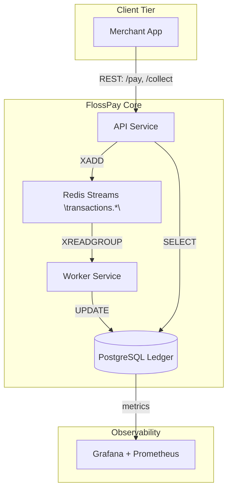

```text

                 /$$$$$$$$/$$                              /$$$$$$$                   
                | $$_____/ $$                             | $$__  $$                  
                | $$     | $$  /$$$$$$   /$$$$$$$ /$$$$$$$| $$  \ $$/$$$$$$  /$$   /$$
                | $$$$$  | $$ /$$__  $$ /$$_____//$$_____/| $$$$$$$/____  $$| $$  | $$
                | $$__/  | $$| $$  \ $$|  $$$$$$|  $$$$$$ | $$____/ /$$$$$$$| $$  | $$
                | $$     | $$| $$  | $$ \____  $$\____  $$| $$     /$$__  $$| $$  | $$
                | $$     | $$|  $$$$$$/ /$$$$$$$//$$$$$$$/| $$    |  $$$$$$$|  $$$$$$$
                |__/     |__/ \______/ |_______/|_______/ |__/     \_______/ \____  $$
                                                                             /$$  | $$
                                                                            |  $$$$$$/
                                                                             \______/ 
```

---

**FlossPay** is a **Kernel-inspired**, **enterprise-grade** Free/Libre Open-Source payments aggregator.
Modeled after **Linux’s** rigorous governance (meritocratic maintainership, strict code review, transparent changelogs) and **Oracle Financials** audit-first architecture (immutable ledgers, compliance-ready schemas), **FlossPay** delivers bank-grade reliability to indie merchants, MSMEs, and developers.
With a community-driven ethos, FlossPay removes barriers and empowers small businesses with open, transparent infrastructure.
> **Current Rail Availability**: *v0.2-alpha offers a hardened **UPI rail**, fully tested and validated; downstream rails (cards, wallets, net-banking) are tracked via stable branches and will not affect core stability.*

---

## Vision & Mission

### Vision

Payment infrastructure must be **open**, **transparent**, and **gatekeeper-free**.

### Mission

Deliver an **auditable**, **modular**, **self-hostable** payments platform that rivals proprietary gateways while remaining FLOSS.

---

## Table of Contents

1. [Vision & Mission](#vision--mission)
2. [Solution Architecture](#solution-architecture)
3. [Project Structure](#project-structure)
4. [Domain Model](#domain-model)
5. [API Reference](#api-reference)
6. [Roadmap](#roadmap)
7. [Idempotency & Reliability](#idempotency--reliability)
8. [Getting Started](#getting-started)
9. [Production Readiness](#production-readiness)
10. [Testing & Auditing](#testing--benchmarking)
11. [Contributing](#contributing)
12. [Community & Support](#community--support)
13. [License & Maintainers](#license--maintainers)

---

## Solution Architecture

<details>
<summary>View Architecture Diagram</summary>



</details>

**Key Principles**

* **Modularity**: Clear service contracts for scalability.
* **Async Resilience**: Failure-isolated pipelines via Redis Streams.
* **Auditability**: Immutable ledger with SHA-256 checksums.

---

## Project Structure 

| Module           | Responsibility                                         | Key Technologies                    |
| ---------------- | ------------------------------------------------------ | ----------------------------------- |
| `api-service`    | Public REST API, OpenAPI spec, validation, idempotency | Spring Boot 3.x, Java 21            |
| `worker-service` | Async processing, retries, DLQ, webhook emit           | Java 21, Spring Boot, Redis Streams |
| `shared-libs`    | DTOs, validation, exception hierarchy                  | Java Module System                  |
| `docs`           | UML diagrams, ADRs, system design, benchmarks          | Asciidoc, PlantUML                  |
| `ops`            | Docker, Helm, Terraform, GitHub Actions                | DevOps Stack                        |

---

##  Domain Model 

| Entity                  | Purpose                     | Core Fields                                            |
| ----------------------- | --------------------------- | ------------------------------------------------------ |
| `Transaction`           | Generic payment intent      | id · amount · currency · method · status               |
| `TransactionHistory`    | Lifecycle state changes     | txn\_id · status\_from · status\_to · timestamp        |
| `PaymentMethod`         | Supported rails enum        | UPI · CARD · WALLET · NETBANKING                       |
| `CardTransaction`       | Card-specific data          | pan\_token · expiry · scheme                           |
| `WalletTransaction`     | Wallet-specific data        | wallet\_id · provider                                  |
| `IdempotencyKey`        | Guarantees at-most-once     | key · owner · expiry                                   |
| `WebhookEvent`          | Outbound notifications      | id · type · payload · retries                          |
| `WebhookCallback`       | Tracks delivery & retries   | callback\_id · txn\_id · url · status · attempts       |
| `ServiceCircuitBreaker` | Monitors 3rd-party services | service\_name · state · failure\_count · last\_failure |
| `ClientRateLimit`       | API quota state             | client\_id · tokens · last\_refill                     |

---

## API Reference 

> **Disclaimer:** Only the `/pay`, `/collect`, `/transaction/{id}/status`, and health-check endpoints are active in this release; other endpoints are planned.

* **Prefix:** `/api/v1`
* **Auth:** HMAC-SHA256 (`X-FlossPay-Signature` header)
* **Content-Type:** `application/json`

| Method | Endpoint                   | Description                 | Idempotent | Auth | Response Codes  |
| ------ | -------------------------- | --------------------------- | ---------- | ---- | --------------- |
| `POST` | `/pay`                     | Initiate UPI payment        | ✅          | HMAC | 201 · 400 · 409 |
| `POST` | `/collect`                 | Pull payment from payer     | ✅          | HMAC | 202 · 400       |
| `GET`  | `/transaction/{id}/status` | Retrieve transaction status | ❌          | HMAC | 200 · 404       |
| `GET`  | `/health/live`             | Liveness probe (no auth)    | ❌          | None | 200             |
| `GET`  | `/health/ready`            | Readiness probe (no auth)   | ❌          | None | 200 · 503       |

<details>
<summary>cURL Example: `/pay`</summary>

```bash
curl -X POST http://localhost:8080/api/v1/pay \
  -H "Content-Type: application/json" \
  -H "Idempotency-Key: unique-key-280" \
  -d '{"senderUpi": "FlossAlice@upi", "receiverUpi": "FlossBob@upi", "amount": 28}'
```

</details>

*Swagger UI available at `/swagger-ui.html` (auto-generated from OpenAPI 3.1 spec).*

---

## Roadmap

| Phase / Branch                   | Core Deliverables                                   | Why it Matters                |
| -------------------------------- | --------------------------------------------------- | ----------------------------- |
| `feature/advanced-tx-feat`       | Retry · DLQ · Audit trail · Webhooks · Rate-limiter | Enterprise reliability        |
| `test/suite-performance_metrics` | Load/soak · Chaos suite                             | BigTech QA standards          |
| `ship/e2e-documentation`         | UML diagrams · ADRs · Benchmarks                    | Interview-grade documentation |
| `ship/ossify`                    | Issue templates · Badges · Code of Conduct          | Community engagement          |
| **Post-MVP (coming soon)**       |                                                     |                               |
| `feature/devops`                 | CI/CD hardening · Docker/Compose                    | Prod zero-touch deployments   |
| `feature/iac-k8-aws-deployment`  | Terraform & Helm charts for AWS/EKS                 | Cloud-native credibility      |
| `feature/sre-monitoring`         | SLOs · Alerting · Runbooks · Chaos                  | SRE discipline                |

---

## Idempotency & Reliability 

*Powered by enterprise-grade security and compliance to match Oracle-level standards.*

**Idempotency Header**

* `Idempotency-Key: <uuid4>` enforced per route.
* Cryptographically signed UUID; replay attacks mitigated via HMAC verification and TTL-based expiration.

**Retry Strategy**

* Exponential backoff (2¹…2⁵ sec), max 5 retries, then push to DLQ (`transactions.dlq`).
* Configurable backoff window stored securely; supports FIPS-approved pseudorandom delays.

**Circuit Breaker**

* Table `service_circuit_breakers` tracks 3rd-party health.
* Auto-trips on threshold breaches; logs to secure audit vault.
* Aligned with **ISO 27001**; periodic self-tests for resilience.

**Rate Limiter**

* Token-bucket per `client_id` (`client_rate_limits`) with JWT-authenticated quotas.
* SLA-driven tiered quotas; integrates with **OAuth 2.0** scopes.
* Rate changes audited via immutable ledgers.

**Audit Trail**

* All state changes in immutable PostgreSQL `INSERT ONLY` partitions.
* SHA-256 checksums per record; tamper-evident logs.
* Logs shipped to **ELK stack** (Elasticsearch, Logstash, Kibana) with field‑level encryption at rest.
* Complies with **PCI‑DSS** for logging and retention.

**Data Encryption & Key Management**

* AES-256-GCM encryption at rest for sensitive data.
* Keys managed via **AWS KMS** or on-prem HSM; PCI 3DS compliance.

**Transport Security**

* All inter-service calls over TLS 1.3 (mutual auth supported).
* HMAC-SHA256 signatures on API requests; KMIP-compliant key rotation.

**Compliance & Monitoring**

* **PCI‑DSS Level 1** ready; SOC 2 controls implemented.
* Prometheus Alertmanager detects anomaly in retry/failure rates.
* PagerDuty alerts for DLQ backlogs, circuit‑breaker events.

**Governance & Review**

* Enforces **CIS Benchmarks**; CI checks for compliance.
* Quarterly 3rd‑party pen tests; reports published in security portal.

---

## Getting Started 

1. **Clone & Bootstrap**

   ```bash
   git clone https://github.com/flosspay/flosspay.git && cd flosspay
   ./mvnw verify -Pdev
   ```
2. **Provision PostgreSQL & Redis**

   ```bash
   # PostgreSQL
   psql -U postgres -c "CREATE DATABASE flosspay_db;"
   psql -U postgres -c "CREATE USER flosspay_user WITH PASSWORD 'secret';"
   psql -U postgres -c "GRANT ALL PRIVILEGES ON DATABASE flosspay_db TO flosspay_user;"

   # Redis (Memurai or redis-stack)
   redis-cli ping  # -> PONG
   ```
3. **Run All Services (Dev Mode)**

   ```bash
   ./scripts/dev-up.sh   # spins api-service, worker-service, postgres, redis via Docker Compose
   ```

---

##  Production Readiness 

| Capability         | Implementation                                                         |
| ------------------ | ---------------------------------------------------------------------- |
| Config & Secrets   | Spring Cloud Config + KMS-encrypted env vars                           |
| Observability      | Micrometer → Prometheus → Grafana; Sleuth for trace IDs                |
| Security Screening | OWASP Dependency Check CI gate; JPA parameter binding; TLS-only        |
| Compliance         | PCI-DSS tokenization for cards; Audit log immutability; SOC 2 controls |
| Scalability        | Horizontal scaling of worker groups; Kubernetes-ready manifests        |

---

## Testing & Benchmarking 

* **Unit Tests:** 80%+ coverage; mutation testing via PIT.
* **Integration Tests:** Testcontainers spin up Postgres & Redis.
* **End-to-End Tests:** Gatling scenarios simulating `/pay → /status` loops.
* **Performance:** CI perf job targets 1k TPS.

CI pipeline defined in `.github/workflows/ci.yml` with stages: lint → test → coverage → perf.

---

##  Contributing 

1. **Fork** the repo → create a `feature/<topic>` branch.
2. Run `./scripts/pre-commit.sh` (lint, tests).
3. Open a Pull Request; GitHub Actions will run CI checks.
4. Merge when reviewed; CI deploys to staging automatically.

Refer to [`CONTRIBUTING.md`](docs/CONTRIBUTING.md) and [`CODE_OF_CONDUCT.md`](docs/CODE_OF_CONDUCT.md).

---

##  Community & Support

* **GitHub Issues:** Report bugs & request features.
* **GitHub Discussions:** Ask design questions & propose RFCs.
* **Security Vulnerabilities:** Email `security@flosspay.dev` (GPG key in repo).

---

## License & Maintainers 

* **License:** MIT (see [`LICENSE`](LICENSE)).
* **Core Maintainer:** David Grace — Bangalore, IN.

For sponsorship inquiries or further engagement, open an issue or discussion.

